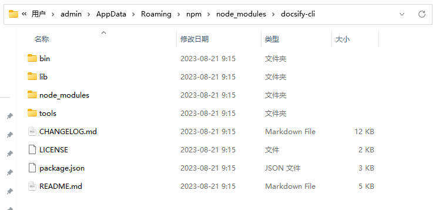

# 操作指南
## docs展示效果

[试编译](https://chris-li828.github.io/#/)

## docsify项目初始化

1、安装Node.js

官网地址：

[Node.js (nodejs.org)](https://nodejs.org/zh-cn)

下载对应版本：

2、安装docsify-cli工具

cmd 全局安装：npm i docsify-cli -g

安装后会在这个路径下 C:\Users\Administrator\AppData\Roaming\npm\node_modules 生成 docsify-cli 文件夹。

3、初始化文档结构

在当前文件夹下创建docs目录：docsify init ./docs

4、本地实时预览

在docs目录下执行：docsify serve docs

即可在[Document](http://localhost:3000/#/)查看

<!--
[<<返回首页](README)-->